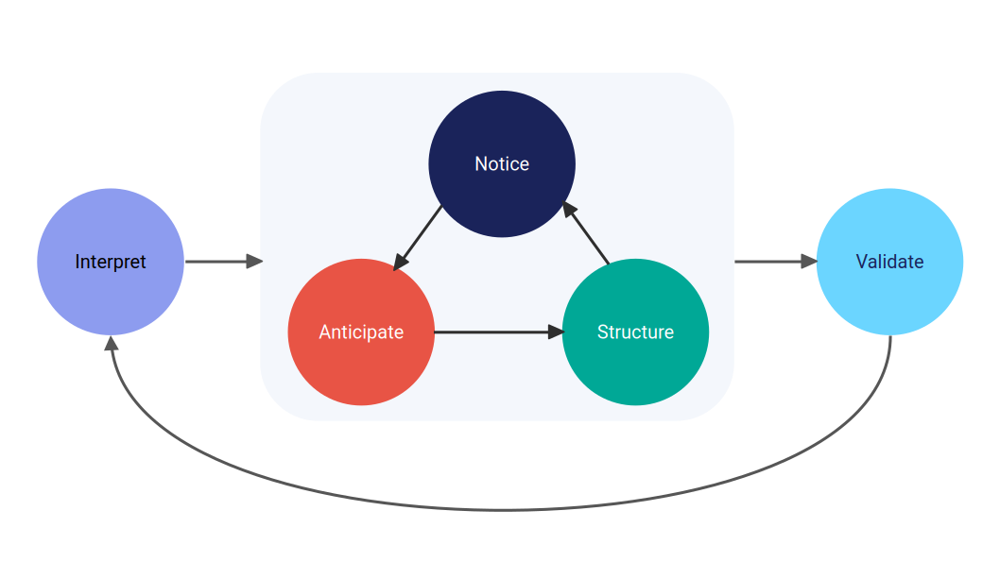

```{r setup, include=FALSE}
knitr::opts_chunk$set(collapse = TRUE, comment = NA, warnings = FALSE, message = FALSE)
library(bidux)
```

> 🚀 `{bidux}` v0.1.0 is live on CRAN!<br>
> Users don't just see your dashboard: They interpret it, navigate it, and act (or fail to act) based on it. That's not just design; it's cognition.<br>
> Learn more below or explore the repo: [github.com/jrwinget/bidux](https://github.com/jrwinget/bidux)

## Why UX Is Too Often an Afterthought

In data analytics and dashboard development, we often get the logic right: The data is clean, the calculations are correct, and the visualizations are technically sound. But when the dashboard goes live, something breaks.

Users ignore insights. Or worse, they disengage entirely.

This isn't a reflection of poor technical work. It's a sign that something deeper is missing: A bridge between how we design interfaces and how people actually think.

Most developers aren't trained in psychology or UX. That's not a failing; it's a gap in the pipeline. Users interpret our tools through human lenses: They carry cognitive limitations, rely on mental shortcuts, and make judgments shaped by emotion, context, and bias.

To design dashboards that not only work, but *resonate*, we need to design for the mind, not just the machine.

## A New Starting Point: BID + `{bidux}`

The **Behavior Insight Design (BID)** framework offers a structured, evidence-based approach to building more intuitive, cognitively supportive dashboards. Developed at the intersection of behavioral science, data storytelling, and interface design, BID maps out five stages that reflect how users actually engage with information:



Each stage helps developers reduce friction, surface insight, and support better decision-making, even without a background in psychology or UX.

The `{bidux}` R package makes this framework practical for developers. It provides a step-by-step workflow, concept dictionaries, and component suggestions that bring behavioral design directly into your Shiny development process.

Together, BID and `{bidux}` help you turn psychological friction into flow.

## What Makes BID Different?

Most design systems focus on aesthetics or layout heuristics. BID starts earlier by asking what your user *needs to think, feel, and decide* at each stage of interaction.

BID is grounded in cognitive psychology, decision science, and information processing theory. It doesn't just tell you what to build; it explains *why* certain design choices succeed or fail, based on decades of empirical research.

And while other frameworks often isolate usability issues or user behavior, BID treats these mechanisms as dynamically linked. For instance:

- How **cognitive load** affects susceptibility to bias
- How early layout decisions shape later interpretations
- How interface design impacts individual and group coordination

`{bidux}` brings this theory into practice, giving you the tools to identify friction points, document key decisions, and structure your dashboard with the user's cognition in mind.

## The Five BID Stages (with `{bidux}` Examples)

### 1️⃣ **Interpret the User's Needs**

**Goal**: Center your design around the core questions users are trying to answer.

> Users don't want every chart: They want clarity about what matters, and often more importantly, what to do about it.

```{r}
stg_interpret <- bid_interpret(
  central_question = "Where are sales underperforming?",
  data_story = list(hook = "...", tension = "...", resolution = "...")
)
```

**Try**: Structuring the app like a narrative; defining user personas to anchor your story.

### 2️⃣ **Notice the Problem**

**Goal**: Identify where users struggle cognitively, visually, or emotionally.

> Most friction stems from overload: Too many filters, unclear hierarchies, or competing focal points.

```{r}
# install.packages("bidux")
# library(bidux)

stg_notice <- bid_notice(
  stg_interpret,
  problem = "Users can't find the key metrics",
  evidence = "70% of testers took >30s locating the primary KPI"
)
```

**Try**: Swapping dropdowns for grouped radio buttons; surfacing KPIs higher in the layout.

### 3️⃣ **Anticipate User Behavior**

**Goal**: Account for predictable biases in how users interpret and interact with data.

> People often anchor on the first number they see, seek out confirming evidence, and interpret identical outcomes differently depending on how they're framed

```{r}
stg_anticipate <- bid_anticipate(stg_notice)
```

**Try**: Showing both "65% complete" and "35% remaining"; providing scenario toggles to challenge assumptions.

### 4️⃣ **Structure the App**

**Goal**: Organize layout and flow to reduce decision errors and guide attention.

```{r}
stg_structure <- bid_structure(stg_anticipate)
```

**Try**: Grouping filters near relevant charts; using `bslib::card_body(padding = 4)` for visual spacing.

### 5️⃣ **Validate & Empower the User**

**Goal**: Reinforce clarity, support confidence, and enable action (individually or as a team).

```{r}
stg_validate <- bid_validate(stg_anticipate)
```

**Try**: Ending with a clear takeaway panel; adding next-step checklists or shareable reports.

## Try It Out

Example flow:

```{r}
library(bidux)

# Align the dashboard with user goals
workflow <- bid_interpret(central_question = "Which products underperformed?") |>

  # Identifying user friction point
  bid_notice(
    problem = "Too many filters",
    evidence = "Users forget the currently selected options"
  ) |>

  # Address predictable cognitive biases (leave blank for auto-suggestions)
  bid_anticipate(
    bias_mitigations = list(
      anchoring = "Include prior year as reference",
      confirmation_bias = "Show competing explanations"
    )
  ) |>

  # Design information structure
  bid_structure() |>

  # Reinforce clarity and enable collaboration
  bid_validate(summary_panel = "Key takeaways with export")
```

Then explore suggestions:

```{r}
bid_suggest_components(workflow, package = "bslib")
```

## Learn More

- 📦 GitHub: [jrwinget/bidux](https://github.com/jrwinget/bidux)
- 📚 Vignettes: `introduction-to-bid`, `concepts-reference`, `getting-started`
- 👀 Theory paper coming soon! [Watch this space](https://github.com/jrwinget/bid-framework)

## Final Thoughts

Better dashboards aren't just more attractive; they're more *intelligible*. They reduce unnecessary decisions, anticipate user confusion, and surface what matters.

The BID framework gives developers a behavioral lens. `{bidux}` gives them the tools to act on it.

You don't need a psychology degree to design with cognitive empathy, just the right questions and the right support. `{bidux}` helps you ask both.

Happy designing! 🚀
