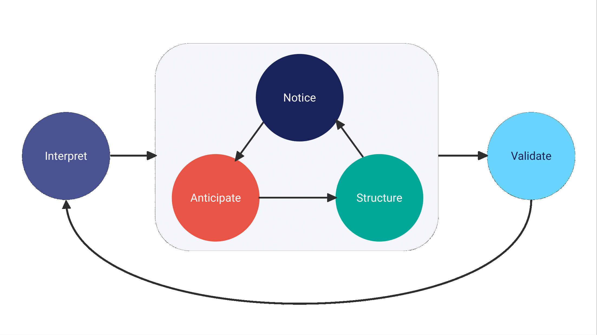

I'm excited to announce that **bidux 0.3.1** is now available on CRAN. This release brings telemetry deeper into the Behavioral Insight Design (BID) framework, strengthens stage consistency, and smooths the migration path for users moving from earlier versions.

## A Modern Telemetry Workflow

Telemetry data is increasingly central to BID workflows. Until now, telemetry ingestion produced list-like objects that worked but weren't always convenient for analysis.

In **0.3.1**, `bid_ingest_telemetry()` now returns **hybrid telemetry objects**: they behave like lists for backward compatibility, while adding new methods such as `as_tibble()` and `bid_flags()`.

For new projects, the preferred interface is the tidy-friendly `bid_telemetry()`, which returns structured tibbles (`bid_issues_tbl`) ready for `dplyr` pipelines:

```r
issues <- bid_telemetry("telemetry.sqlite")
critical <- issues |> filter(severity == "critical")
```

## From Telemetry to BID Stages

This release also introduces **bridge functions** that connect telemetry issues directly to BID stages:

* `bid_notice_issue()`: convert one issue into a Notice stage
* `bid_notices()`: batch process multiple issues
* `bid_address()`: quickly act on a set of issues
* `bid_pipeline()`: process the first *N* issues with limits

These functions make it easier to move from raw telemetry data to structured BID insights without extra glue code.

## A Quick Example

Here's what a telemetry-informed BID pipeline can look like in **0.3.1**:

```{r, eval=FALSE}
library(bidux)
library(dplyr)

# Ingest telemetry as tidy issues
issues <- bid_telemetry("telemetry.sqlite")

# Focus on the most severe issues
critical <- issues |>
  filter(severity == "critical")

# Turn those into BID notices
notices <- bid_notices(critical)

# Move forward through the pipeline
structure <- bid_structure(notices, telemetry_flags = bid_flags(critical))
validate  <- bid_validate(structure, telemetry_refs = critical)
```

This pipeline takes real user behavior (via telemetry), surfaces critical issues, and carries them through to **structured design recommendations** and **validation**, all with tidy, pipeline-friendly functions.

## Framework Stability and Improvements

Alongside telemetry, this release improves framework stability and consistency:

* **Stage order correction**:
  * BID stages now follow the canonical sequence: *Interpret → Notice → Anticipate → Structure → Validate*
  * Migration support is built in, so older outputs remain interpretable



* **Unified suggestion system**:
  * Interpret, Notice, and Validate now share consistent rules, reducing duplication and simplifying outputs

* **Structure and validation refinements**:
  * `bid_structure()` can adjust recommendations using telemetry flags (e.g., avoid tabs if navigation drop-offs are detected)
  * `bid_validate()` can link validation results back to the telemetry issues that motivated them

## Migration and Deprecations

Existing telemetry code continues to work, but now has access to the enhanced features. Looking ahead to **0.4.0**:

* `bid_ingest_telemetry()` will be soft-deprecated in favor of `bid_telemetry()`.
* Layout auto-selection in `bid_structure()` and layout-specific bias mitigations in `bid_anticipate()` will be removed in favor of concept-driven approaches.

## Documentation and Tests

We've updated the **Getting Started** vignette with new telemetry examples and corrected stage numbering, and expanded the **Telemetry Integration** vignette to show the new tidy workflow. Test coverage has been broadened across new methods, bridge functions, and migration utilities.

## Install the Latest Release

You can install **bidux 0.3.1** from CRAN today:

```{r, eval=FALSE}
install.packages("bidux")
```

This release makes working with telemetry in BID smoother, tidier, and more consistent. It strengthens the framework while keeping migration straightforward, so you can spend less time adapting code and more time focusing on insights.
