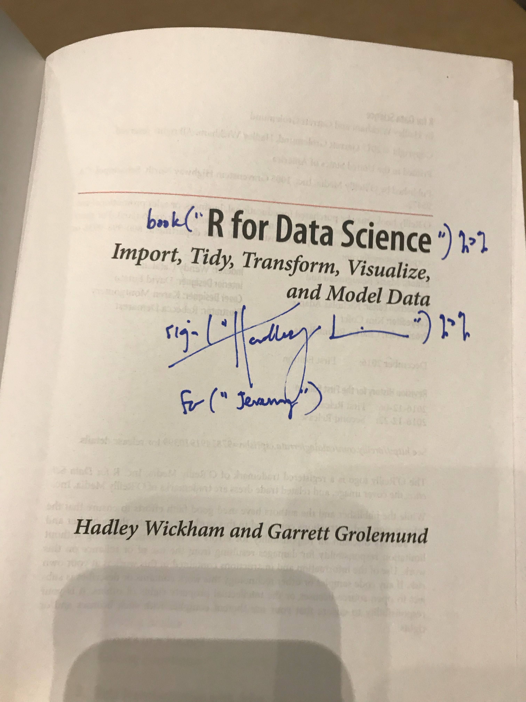
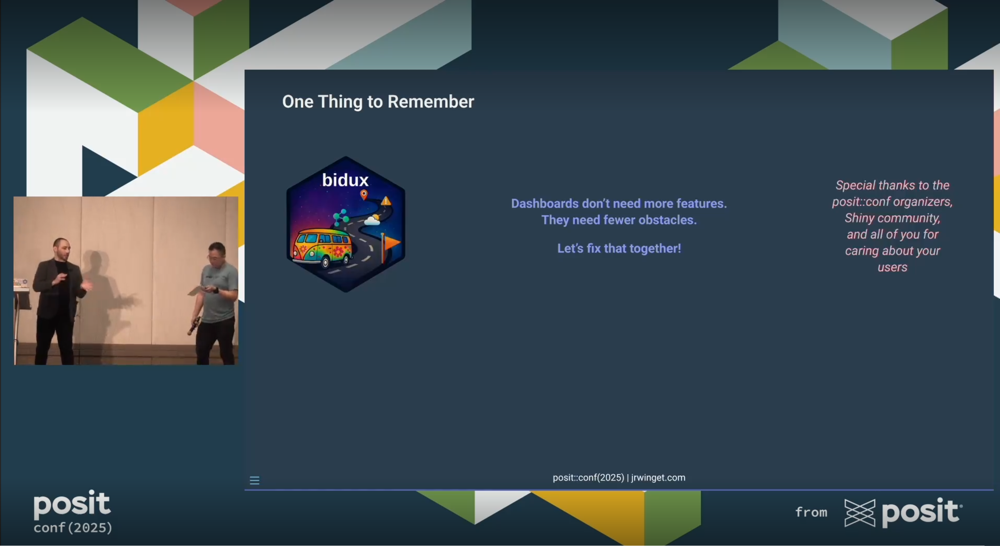

## A Cold Chicago Winter, a Warm San Diego Welcome

My first rstudio::conf was 2018 in San Diego, late January. Coming from Chicago, that felt like a small miracle. I had about six or seven months of R and the `{tidyverse}` behind me, was still studying social psychology in grad school, and had only ever done academic conferences. Walking into this one felt different; bigger stage, crisper production, and a sense that tooling and community might actually pull in the same direction.

{.float-start .rounded .shadow-sm width="33%"}

I went with my closest friend from grad school, who'd already transitioned into data science. Everyone I met was working in ML, deep learning, or advanced quant at huge companies I'd only seen on slides. But these folks were also disarmingly kind. When I said I was a psychologist, often labeled a "soft science" in tech circles, no one waved me off. Instead, they just asked how I used R in my work. I talked about group decision making and computational modeling. People's eyes widened. They leaned in. That surprised me, and it stuck.

The talks were practical and alive: Live demos, tools I could try immediately. I left able to build my first website with `{blogdown}` (which I *just* migrated from yesterday; and this is my first post with new Quarto setup). I also met Hadley and got my copy of *R for Data Science* signed. Total fanboy moment, noted and accepted.

## The Click: Where My Work Meets My Values

My academic work looked at group decision making as a system of information processing. That lens made me care about how evidence actually moves through a pipeline: methods, statistics, and whether the work is verifiable by someone who is not me.

Very quickly, I realized three ideas were inseparable for me: open science, open source, and open access. Not as slogans, as habits. That looks like preregistration and reproducible code, but also public issue threads, code review in daylight, and packages stewarded by a community instead of a gatekeeper. R and Posit folks treated these not as extras but as table stakes. That alignment shaped my path toward building systems that lower friction and widen access for other people.

**What open science and open source share in practice (how I try to work):**

- Make claims traceable: Analysis scripts, data lineage, and assumptions live with the work
- Prefer repair to perfection: Log issues, document tradeoffs, and improve in public
- Share context, not just code: Explain what a function is for and how to use it responsibly
- Design for stewardship: Make it easy for someone else to keep the lights on after you

## Why I Keep Coming Back

I keep returning because the technical depth is matched by something rarer: A culture that is welcoming without theater. You can engage on your own terms. I've given talks at other conferences, but at posit::conf, I mostly come to learn, listen, and connect. The constant has always been folks who treat curiosity as a shared resource.

I've read a lot of posts about people's posit::conf experiences over the years, and they all match exactly what I've felt since 2018: belonging, room to participate at your own pace, serious inspiration, hands-on collaboration, and small moments of joy that matter more because of the people you share them with.

If you know, you know. And if you don't, I hope you join us to find out.

## From Audience to Speaker

Last week, I stepped onto the posit::conf stage for the first time. Just being accepted was an honor. Every year there are more excellent proposals than slots, so a "yes" signals the committee is trusting you to carry something useful onto that stage. And I was there to share something I care deeply about: the intersection of behavioral science and tool design.

I spoke about bringing these ideas to Shiny so teams can design apps that reduce cognitive friction instead of creating it, to think about cognitive engineering as much as we do performance engineering. Think fewer "data dumps" with dozens of dropdowns and more guided flows that surface the right decision at the right moment. Better products for users, fewer support tickets for teams.

{.float-end .rounded .shadow-sm width="65%"}

I was anxious the whole week leading up to my talk, which isn't unusual since I often feel that way before presenting. I've spoken at other conferences, led workshops, and taught college courses, so public speaking is familiar territory. But this felt different. The moment I walked on stage and brought up my slides, the anxiety disappeared! I had *never* experienced that before. It felt like a conversation with friends who care about good tools and solid evidence. The examples landed, the audience leaned in, and the Q&A could have gone on much longer if we hadn't run out of time.

It was easily the most fun I've ever had giving a talk; truly an experience I'll carry with me for a long time. The best part might have been the hallway follow-ups: quick notebook sketches, a few "this changes how I think about building dashboards" epiphanies, and two separate chats about adapting the ideas for decision-making research.

I'm so grateful to the Posit team for creating conditions where growth is possible, and to this polyglot community for making it feel like home. The spirit that met me in 2018 is still doing profound, durable work.

## A Day Contributing: Tidyverse Developer Day

After the main program, I spent most of Friday at Tidyverse Developer Day: A room full of people contributing to `{tidyverse}` packages with the authors and maintainers working alongside them. The team curates issues for all skill levels, with helpers floating around to unblock any hiccups that might come up.

::: {.callout-tip title="Tidyverse Developer Day (TDD) resources:" .float-end width="50%"}
- [TDD 2025 info](https://www.tidyverse.org/blog/2025/07/tdd-2025/)
- [TDD repo](https://github.com/tidyverse/tidy-dev-day)
- [Code of Conduct](https://github.com/tidyverse/tidy-dev-day/blob/main/CODE_OF_CONDUCT.md)
:::

It's a welcoming space for a topic that can feel high-friction the first time you try it. The bar to contribute drops incredibly fast when someone says, "let's open the issue and look together". This year, Joe Cheng was at my table, a genuine delight for this avid Shiny user.

I **strongly suspect** days like this compound: first PRs become second and third ones, kind reviews early on create the next round of kind reviewers, and the effect spills into broader open source ecosystems.

## What I Took Home This Time

- A **clearer north star** for my work: Build systems that help reduce friction, support better choices, and promote equitable collaboration so the next person/team moves faster.
- A reminder that **precision and kindness are not in tension**: You can ask for evidence and still be generous. They are not mutually exclusive but mutually necessary for progress.
- A short list of **things next**: Deepen Rust knowledge, keep improving `{bidux}`, continue bridging behavioral science and tech, and always strive to meet people where they are.

## Looking Ahead

Seven years later, I still leave recharged and focused. My plan is simple: Pay forward the clarity and encouragement this community gave me. Build things that make it easier for the next person to do good work.

If that sounds like your kind of place, I look forward to seeing you there!
