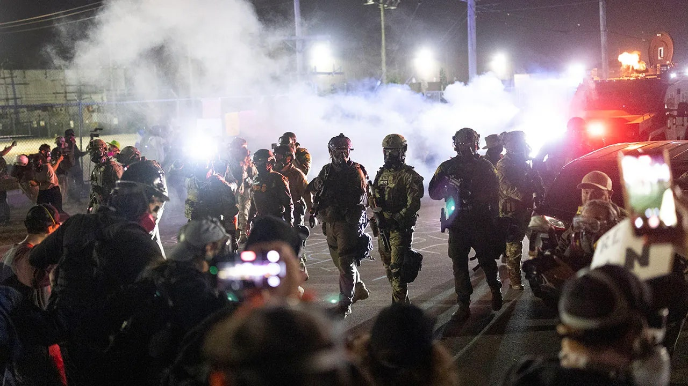

## A Crowd, A Crisis, and the Wrong Problem

The crowds gathered fast. Flags, chants, phone cameras, all aimed squarely at the latest political flashpoint. The air pulsed with conviction. Something needed to be done *now*.

On the surface, it looked like decisive action. Underneath, something quieter was happening: a narrowing of attention, a collapse of deliberation, and the slow suffocation of the space for dissent.

{.float-end .rounded .shadow-sm width="45%" fig-alt="Illustration showing a broad perspective view of multiple interconnected systems and factors, representing how collective attention can narrow and miss underlying systemic issues"}

When a society starts rewarding volume over substance, when disagreement feels like betrayal, groups of every size (from governments to dev teams) begin solving the wrong problems. The visible threat becomes the total focus, while the underlying systems quietly degrade.

Protest and mobilization have always been vital forces for change. But when attention is hijacked by spectacle rather than substance, even the most righteous energy can be redirected away from root causes. Especially when those in power find it useful to change the subject.

## How Groups Actually Think

Groups aren't irrational; they're just wired for coordination first and accuracy second.

Decades of research by scholars like Ivan Steiner, James Davis, Scott Tindale, and Verlin Hinsz[^1] show groups behave less like committees of thinkers and more like **information processors**: limited, distributed, and biased toward what's already shared among its members.

[^1]: Key figures in group information processing theory and social decision schemes research

In easy tasks, that works beautifully. Shared information dominates the discussion, members align, and confidence rises. But in complex tasks, where critical information is unevenly distributed, the same bias backfires. Members repeat what's already known, while unshared facts stay buried in individual minds. The group, ironically, becomes *less* intelligent than its smartest member.

::: {.column-margin}
This is the **hidden-profile problem**: when the best solution requires integrating information that no single member fully possesses, groups systematically fail unless structures force information sharing.
:::

That's why systems designed for consensus can unintentionally hide insight. They reduce friction but also filter out the unusual, the dissenting, and the diagnostic. It's the hidden-profile problem in every form, from juries to code reviews to global policy debates.

::: {.callout-note icon=false appearance="simple"}
## Richard Hackman's rule[^2]
 
Performance isn't about motivation or personality; it's about *design.* 
Groups fail because their structures make the right conversations impossible.
:::

[^2]: J. Richard Hackman, pioneering researcher on team effectiveness and organizational design

## The Comfort of Shared Myopia

Most groups don't consciously suppress new information. They just drift toward what's easy to agree on.

The bias runs deep: Sharedness feels safe. Familiar ideas reward us with microbursts of social approval. Each nod and "exactly!" strengthens the illusion that consensus equals truth.

{.float-end .rounded .shadow-sm width="45%" fig-alt="Diagram showing pluralistic ignorance: multiple figures with thought bubbles where outer bubbles show agreement with the group but inner thoughts reveal private doubts, illustrating how silent agreement masks private disagreement"}

Pluralistic ignorance amplifies this. Everyone privately doubts the shared focus, but no one wants to be the first to say so. And so, silence masquerades as agreement. Even those who *do* see the structural issue start calibrating their language, testing the wind before speaking up.

You've seen this in the workplace too. A dev team argues for hours about a UI color but defers a looming database overhaul. The visible topic feels more manageable, more social, more *presentable*. Under pressure to align, attention collapses to the path of least resistance.

In social systems and engineering alike, the group's collective gaze narrows exactly when it needs to widen.

## The Minority Report

This is where minority influence enters the picture. And where Tindale's work becomes vital again.

Contrary to popular belief, minority influence isn't about defiance. It's about **maintenance**. Groups need dissent not because it feels good, but because it keeps the system adaptive. Minorities serve as informational scouts, probing the blind spots created by majority dynamics.

When dissenters persist with clarity and evidence, they do something remarkable: They *reframe* the problem space!

::: {.aside}
Moscovici's studies showed that even a single consistent dissenter can shift the majority's private judgments, even when public positions remain unchanged.
:::

Serge Moscovici[^3] called this **conversion**, a quiet shift in others' internal representations. The surface debate might stay unchanged, but the cognitive landscape underneath reorganizes. People start *thinking differently*, even if they don't admit it out loud.

[^3]: Social psychologist who developed the theory of minority influence and social representations

In political life, this can look like a single journalist or local mayor calling out creeping authoritarianism long before it trends. In software development, it's the engineer who refuses to cut corners on testing because she's seen what happens when systems fail silently. Different stakes, same mechanism: Dissent preserves information diversity, the lifeblood of collective intelligence.

## The Real Threat

Authoritarianism thrives on the suppression of dissent not just for control, but because it *simplifies cognition*. When loyalty replaces deliberation, systems get faster...but dumber. They trade complexity for coordination, nuance for narrative.

That same tradeoff happens in corporate culture when "alignment" becomes a euphemism for "agreement". A perfectly aligned team can ship a perfectly flawed product. Everyone's happy...until the structure breaks under the weight of the unspoken.

Hackman would say the fix isn't to exhort people to "speak up". It's to **redesign the environment** so that dissent doesn't require heroism.

::: {.callout-tip icon=false}
## Quick wins for safer dissent

- Structure meetings so unique information is surfaced *first*, before discussion
- Assign a rotating "minority advocate" in critical design reviews
- Value *diagnostic questions* as much as polished answers

These may sound procedural, but they're moral architecture. They protect the system's capacity for truth.
:::

## Why Groups Chase the Visible Target

Let's go back to that protest scene. Every chant, every viral post, every demand for "decisive action" is a bid for cognitive simplicity. People want to make sense of chaos. They want to see the problem, name it, and fix it.

That impulse isn't wrong; it's human. Collective outrage is often the first spark of accountability. The danger comes when leaders or algorithms capture that spark and aim it somewhere safer for power.

Leaders often exploit this tendency, redirecting attention to symbolic skirmishes while dismantling the systems that actually distribute power. The crowd doesn't see the scaffolding behind the spectacle: bureaucratic hollowing, erosion of norms, loss of institutional memory. They're staring at the storm, not the climate.

You can watch this in microcosm every day inside organizations. A leadership team zeroes in on quarterly optics while ignoring crumbling infrastructure. A product team launches a glossy feature that hides the absence of documentation.

When attention becomes performance, groups start mistaking *visibility* for *impact*.

The cure is not cynicism; it's **redesign**. Make dissent cheap. Make invisible work visible. Create conditions where the most informative signal isn't the loudest one.

## Designing for Dissent

So how do we design for dissent without creating chaos?

Hackman's decades of research give us a deceptively simple blueprint: *Structure, clarity, and purpose are the enabling conditions of collective intelligence.*

::: {.callout-important icon=false appearance="minimal"}
1. **Clarify the real task:** Many coordination failures stem from misaligned problem definitions. Before debate, define what "good" looks like and who holds which pieces of information.

2. **Make unique information explicit:** Start meetings or decisions with a quick round of "what do you know that others might not?" It flattens status cues and seeds information diversity.

3. **Institutionalize dissent:** Rotate a "devil's advocate" or "minority role." Signal that critique is contribution, not disloyalty.

4. **Reward reframing:** Give airtime not only to solutions but to people who *redefine the problem* accurately.

5. **Protect deliberation bandwidth:** Deadlines and visibility metrics compress attention. Allocate protected time for slow, high-value thinking.
:::

These are structural levers, not personality hacks. They let courage scale without burning out the people who supply it.

## When the Group Turns on Itself

There's a haunting irony in collective processes: The same cohesion that helps a group survive can make it fragile to error.

As coordination improves, the social cost of dissent rises. Eventually, good people start self-silencing, assuming someone else will say what needs saying. But they don't. And slowly, the system forgets how to self-correct. You can see this in collapsing democracies, in failing companies, in scientific replication crises, even in open-source communities.

The details change, but the dynamic is identical: When sharedness becomes the goal, truth becomes a casualty.

Dr. Cat Hicks[^4] has described curiosity as a shared resource. Dissent is too. It's how groups stay honest about what they know and what they don't. But unlike curiosity, dissent doesn't feel communal. It feels risky.

[^4]: Researcher studying developer experience, social dynamics in technical teams, and organizational learning

That's why structure matters. It lowers the *social tax* of honesty.

## Reframing What's Worth Talking About

{.float-start .rounded .shadow-sm width="42%" fig-alt="Collage representing group dynamics and systems thinking, with interconnected elements and human figures engaged in dialogue about collective intelligence and decision-making"}

Imagine if our public discourse treated dissent the way high-reliability teams treat anomalies: as signals to investigate, not threats to silence. Imagine if our teams treated disagreement as a sign that the system is alive.

Protest, dissent, and debate are how we remind systems that truth is still a shared project. Because dissent, at its best, is an act of stewardship.

It's the refusal to let collective attention decay into convenience. It's not rebellion; it's repair.

So the next time you're in a meeting, a debate, or a crowd, notice what everyone's staring at...and what no one's mentioning. That's often where the real work begins.

*(And if you're reading this on Halloween, consider it your annual reminder that sometimes the scariest thing in a group isn't the conflict: It's the silence.)*

## Closing Thoughts

When groups get stuck on the wrong problem, it's rarely because they're malicious or ignorant. It's because sharedness feels safe, and dissent feels costly.

But every complex system, whether a government, a research team, or a startup, depends on its ability to surface unshared truths. The question isn't whether we'll disagree. It's whether we've designed the conditions that let disagreement matter.

If democracy is a system for making collective decisions, then teams are its smallest working model. Get the micro right, and the macro starts to follow.

Every movement for justice begins as minority influence. One small group insisting the system can do better.

And maybe that's the lesson tucked inside all this research. Collective intelligence doesn't come from harmony. It comes from friction handled well.
