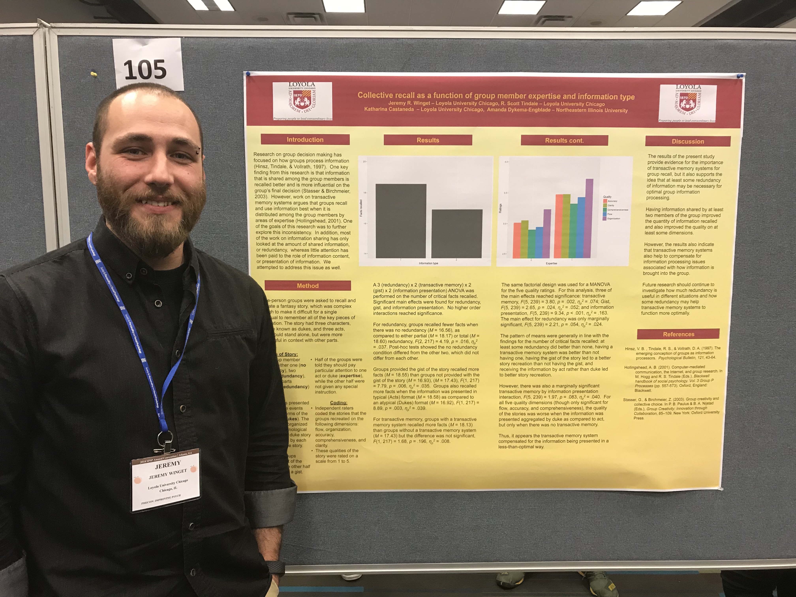
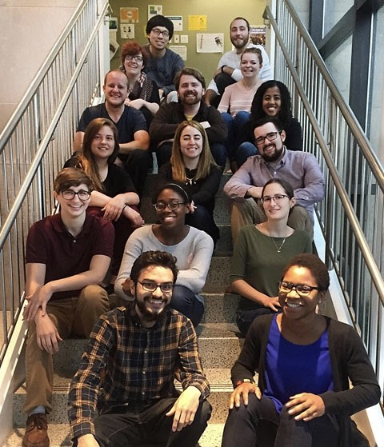

+++
# A Demo section created with the Blank widget.
# Any elements can be added in the body: https://sourcethemes.com/academic/docs/writing-markdown-latex/
# Add more sections by duplicating this file and customizing to your requirements.

widget = "blank"  # See https://sourcethemes.com/academic/docs/page-builder/
headless = true  # This file represents a page section.
active = false # Activate this widget? true/false
weight = 20  # Order that this section will appear.

title = ""
subtitle = ""

[design]
  # Choose how many columns the section has. Valid values: 1 or 2.
  columns = "1"

[design.background]
  # Apply a background color, gradient, or image.
  #   Uncomment (by removing `#`) an option to apply it.
  #   Choose a light or dark text color by setting `text_color_light`.
  #   Any HTML color name or Hex value is valid.

  # Background color.
  # color = "navy"
  
  # Background gradient.
  # gradient_start = "DeepSkyBlue"
  # gradient_end = "SkyBlue"
  
  # Background image.
  image = ""  # Name of image in `static/img/`.
  image_darken = 0.6  # Darken the image? Range 0-1 where 0 is transparent and 1 is opaque.

  # Text color (true=light or false=dark).
  text_color_light = false

[design.spacing]
  # Customize the section spacing. Order is top, right, bottom, left.
  padding = ["20px", "0", "20px", "0"]

[advanced]
 # Custom CSS. 
 css_style = ""
 
 # CSS class.
 css_class = "mini"
+++

I am originally from Michigan, and I'm a proud [Laker for life](https://www.gvsu.edu/). I received my Ph.D. in applied social psychology and quantitative methods from [Loyola University Chicago](https://www.luc.edu/) in 2021. Side note: I do not recommend defending a dissertation during a global pandemic. I'm currently a full-time instructor at Loyola University Chicago.

My [research](https://scholar.google.com/citations?user=UbgwtEwAAAAJ=en) uses computational modeling, machine learning, and online- and laboratory-based experiments to study information processing and exchange. I have written numerous scientific [publications](/publication) on group dynamics and decision making and have presented my research at both national and international conferences.

While at Loyola, I became an avid user of the statistical programming language R, both in the lab as a Principal Investigator and in the classroom as an instructor. I developed a passion for programming and education, and during my time at Loyola, I've developed and taught multiple undergraduate-level [statistics and methods courses](/categories/course/) as well as graduate-level [workshops](/categories/workshop/). I also received an Excellence in Education award from Loyola University Chicago in 2018.

Thank you so much for reading.
